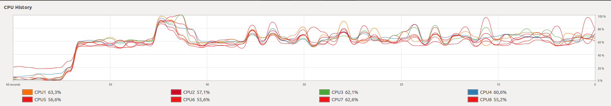
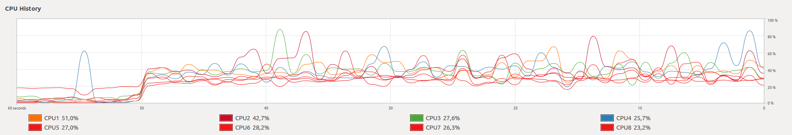

# Technologie NoSQL
**Aliaksandr Novik**

[Crimes in Los Angeles](https://www.kaggle.com/cityofLA/crime-in-los-angeles/data).
This dataset reflects incidents of crime in the City of Los Angeles dating back to 2010. This data is transcribed from original crime reports that are typed on paper and therefore there may be some inaccuracies within the data. Some location fields with missing data are noted as (0°, 0°). Address fields are only provided to the nearest hundred block in order to maintain privacy.

:computer:
Parametry laptopa, na którym byli uruchamiane skrypty:
- System operacyjny: Ubuntu 16.04
- CPU: Intel i7 (4 rdzeni) 
- Dysk twardy: SSD

1. Uruchomienie instancji mongod dla replica set:

**./bin/runMongod.sh**

2. Uruchomienie skryptu:

**./bin/runLocalReplSet.sh**

### Wyniki oczekiwane
- Real time > User time + System time (więcej o tym tu [REAL TIME IS GREATER THAN USER AND SYS TIME](https://blog.gceasy.io/2016/12/08/real-time-greater-than-user-and-sys-time/))
- Import danych do standalone jest szybszy od replica set (więcej o tym tu [Mongoimport](https://docs.mongodb.com/manual/reference/program/mongoimport/))
- Import danych w formaci json jest szybszy od importu danych w formacie csv
- Czas importu z ustawieniem j: true ma być dłuższy od improtu danych z ustawieniem j: false (co to jest [Journaling](https://docs.mongodb.com/manual/core/journaling/))
- Najkrótszy czas dla replica set będzie osiągnięty dla ustawień w: 1, j: false

Wyniki zapisywane do pliku *results.txt* w folderze *docs*.

Tabela 1. Średnie czasu importu plików crimes.csv i majowieckie.json
  <table border=1>
  <tr>
    <th rowspan="2">Settings</th>
    <th colspan="3">Avg time crimes.csv</th>
    <th colspan="3">Avg time mazowieckie.json</th>
  </tr>
  <tr>
    <td>Real time</td>
    <td>User time</td>
    <td>System time</td>
    <td>Real time</td>
    <td>User time</td>
    <td>System time</td>
  </tr>
  <tr>
    <td>Default</td>
    <td>2m39.4432s
      159,4432s</td>
    <td>1m43.2424s
      103,2424s</td>
    <td>0m8.6016s
      8,6016s</td>
    <td>1m49.6122s
      109,6122s</td>
    <td>1m15.5248s
      75,5248s</td>
    <td>0m3.5408s
      3,5408s</td>
  </tr>
  <tr>
    <td>w: 1, j: false</td>
    <td>2m40.1132s
      160,1132s</td>
    <td>1m42.9704s
      102,9704s</td>
    <td>0m8.0768s
      8,0768s</td>
    <td>1m51.95s
      111,95s</td>
    <td>1m15.4752s
      75,4752s</td>
    <td>0m3.4751s
      3,4751s</td>
  </tr> 
  <tr>
    <td>w: 1, j: true</td>
    <td>2m42.3682s
      162,3682s</td>
    <td>1m42.816s
      102,816s</td>
    <td>0m8.4784s
      8,4784s</td>
    <td>1m49.7756s
      109,7756s</td>
    <td>1m15.9256s
      75,9256s</td>
    <td>0m3.577s
      3,5776s</td>
  </tr>
  <tr>
    <td>w: 2, j: false</td>
    <td>2m42.7596s
      162,7596s</td>
    <td>1m43.1952s
      103,1952s</td>
    <td>0m8.4192s
      8,4192s</td>
    <td>1m51.3964s
      111,3964s</td>
    <td>1m15.3512s
      75,3512s</td>
    <td>0m3.6008s
      3,6008s</td>
  </tr> 
  <tr>
    <td>w: 2, j: true</td>
    <td>2m42.8514s
      162,8514s</td>
    <td>1m43.2352s
      103,2352s</td>
    <td>0m8.3848s
      8,3848s</td>
    <td>1m50.7564s
      110,7564s</td>
    <td>1m15.6152s
      75,6152s</td>
    <td>0m3.5312s
      3,5312s</td>
  </tr> 
  <tr>
    <td>Standalone</td>
    <td>1m3.1854s
      63,1854s</td>
    <td>1m47.4208s
      107,4208s</td>
    <td>0m10.5648s
      10,5648s</td>
    <td>0m33.0072s
      33,0072s</td>
    <td>1m14.8416s
      74,8416s</td>
    <td>0m3.5608s
      3,5608s</td>
  </tr> 
</table>
  
### Analiza wyników
- owszem w przypadku importu danych do *replica set* *real time* ma największą wartość oraz suma *system time* i *user time* nie jest większa od *real time*:+1:. W przypadku importu danych do jednej instancji *mongod* (standalone mode) wyniki nie odpowiadają oczekiwaniam:-1:. Wartość *user time* jest większa od wartości *real time* (w przypadku importu pliku crimes.csv o 69% oraz importu mazowieckie.json o 124%). Ten wynik można wytłumaczyć w następny sposób: przy importowaniu danych do jednej instancji *mongod* wykorzystywana jest przewaga wykonania procesu równolegle na większej ilości rdzeni. Prawdopodobnie, że czaś wykonywania osobnych procesów może się sumować i dawać większy wynik. Z innej strony mamy pytanie: dla czego przy imporcie danych do *replica set* import się nie wykonuje na większej ilości rdzeni. Jeśli *real time* jest większy od *user time*, to proces jest związany z operacjami wejcia/wyjścia. I w tym przypadku wykonanie procesu na wielu rdzeni miałoby małą lub żadną przewagę.
[Why real time can be lower than user time](https://unix.stackexchange.com/questions/40694/why-real-time-can-be-lower-than-user-time)
### 1 Obciążenie procesora przy imporcie danych do *replica set*

### 1 Obciążenie procesora przy imporcie danych do *standalone*

- średnia wartość importu danych (real time) do *replica set* jest dłuższa w 2,6 razy od czasu importu do jednej instancji mongod, co wynika z danych przedstawionych w tabeli 1. Ten wynik spełnia oczekiwania.:+1: Przy importowaniu danych do replica set informacja najpierw się zapisuje do *primary node*, potem dane z *primary node* 'replikowane' (replication process) do *secondary nodes*, co faktycznie jest procesem kopjowania danych do dwuch pozostałych instancji *replica set* z *primary node*.
- średni czas importu danych z pliku json jest o 45% szybszy w przypadku replica set i o 90% szybszy w przypadku standalone mode. Ten wynik jest oczekiwany.:+1: Taka baza danych jak MongoDB używa dokumentów JSON do przechowywania danych. MongoDB reprezentuje dokumenty JSON w formacie zakodowanym binarnie o nazwie BSON. Przy imporcie danych w formacie csv dane się konwertują w format JSON, co oczywiście jest procesem wymagającym dodatkowego czasu.
- Porównując *real time* z włączoną opcją *Journaling* i z wyłączoną opcją *Journaling* można zauważyć, że w większości przypadków czas jest troche dłuższy z opcją *j: true*. Widocznie to jest związane z zapisem informacji do *journal files*, na co jest potrzebny dodatkowy czas. Ale róźnica w czasie jest bardzo mała, co świadczy o tym, że możliwość zapisu informacji o tym jak się odbywa zapis danych dostajemy prawie za darmo.
- przy zapisie danych z ustawieniem *w: 1* od *primary node* jest wymagane potwierdzenie zapisu danych. Przy użyciu ustawienia *w: 2* potwierdzenie zapisu jest wymagane nie tylko od *primary node* ale również od jednego z *secondary node*, co może potrzebować dodatkowego czasu. Dla najlepszej wydajności zalecane jest ustawienie *write concern w: 1*. Czas importu dla ustawień *w: 1, j: false* jest krócej od innych (za wyjątkiem default settings).  

